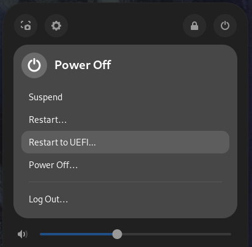

# Reboot to UEFI

This is a small Gnome extension that adds the ability to reboot directly to the UEFI.

 

# Gnome Extensions

This extension is available in [GNOME Extensions](https://extensions.gnome.org/extension/5105/reboottouefi/).

 

### Build and install the extension

Requirements:

- make
- nodejs and npm
- gettext

To build the extension run the following command:

`$ make pack`

If all goes well this will generate a zip file in the project folder.

To install the extension just run the following command:

`$ make install`
