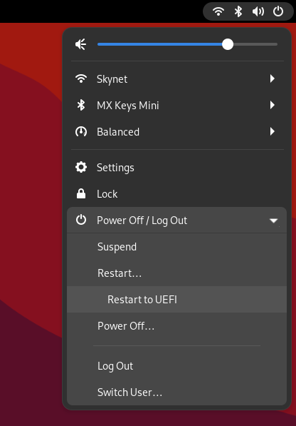

# Reboot to UEFI

This is a small Gnome extension that adds the ability to reboot directly to the UEFI.

 

# Build the extension

To build the extension run the following command:

`$ sh build.sh`

If all goes well this will generate a zip file in the project folder.

# Install the extension

To install the extension just run the **install.sh** script with the following command:

`$ sh install.sh`

 

# Notes

- At some point this extension will be available for installation from the [GNOME Extensions](https://extensions.gnome.org/) web site.

- This extension has been tested on Gnome 42 only.